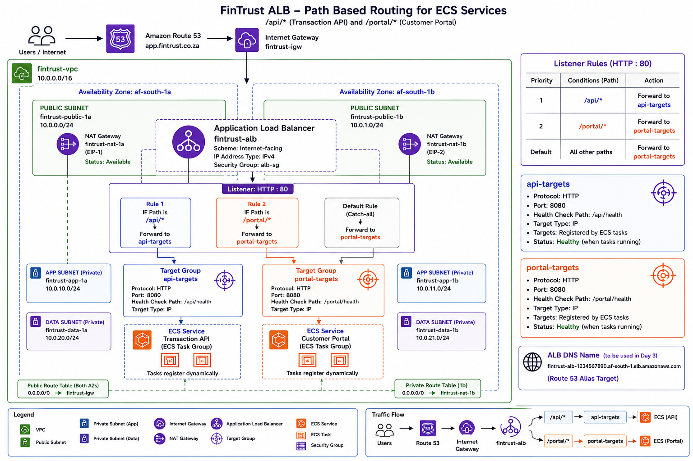
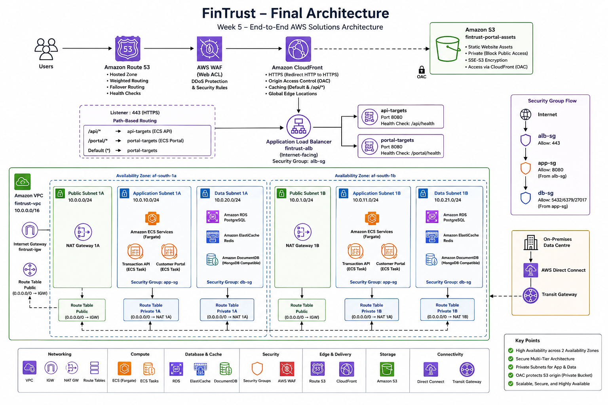

# Week 5 - AWS Networking

This week focused on designing secure, scalable and highly available AWS networking architectures for the FinTrust banking application. Throughout the week, I designed a production-inspired multi-tier network using Amazon VPC, explored enterprise connectivity solutions, implemented intelligent DNS routing with Amazon Route 53, and secured global content delivery using Amazon CloudFront.

The practical labs combined AWS networking theory with architecture design, reinforcing how core networking services integrate to deliver secure and resilient cloud applications.

---

## Week Overview

**Focus:** Amazon VPC, Connectivity, Load Balancing, Route 53 and CloudFront

**Region:** Africa (Cape Town) (`af-south-1`)

---

## Learning Objectives

During Week 5 I learned how to:

- Design highly available Multi-AZ VPC architectures.
- Configure public and private subnets.
- Build secure routing using Internet Gateways, NAT Gateways and Route Tables.
- Apply Security Groups and understand Network ACL behaviour.
- Configure Application Load Balancers with path-based routing.
- Compare AWS connectivity services for different business scenarios.
- Implement DNS routing using Amazon Route 53.
- Deliver secure content globally using Amazon CloudFront.
- Design secure architectures following AWS networking best practices.

---

## Folder Structure

```text
week05/
│
├── README.md
├── reflection.md
├── day1_vpc_build.md
├── day2_connectivity.md
├── day3_route53.md
├── day4_cloudfront.md
├── mock_exam_review.md
│
└── diagrams/
    ├── fintrust_vpc_architecture.png
    ├── fintrust_alb_architecture.png
    ├── fintrust_route53_architecture.png
    └── fintrust_cloudfront_oac_architecture.png
```

---

## Daily Activities

| Day | Topic | Practical Outcome |
|------|-------|-------------------|
| Day 1 | Amazon VPC | Designed a secure Multi-AZ VPC with public and private subnets, NAT Gateways and Security Groups. |
| Day 2 | Connectivity & Load Balancing | Built an Application Load Balancer with path-based routing and compared AWS connectivity services. |
| Day 3 | Amazon Route 53 | Configured hosted zones, Alias records and multiple routing policies. |
| Day 4 | Amazon CloudFront | Secured private Amazon S3 content using CloudFront and Origin Access Control (OAC). |
| Day 5 | Mock Exam | Reviewed networking knowledge and identified improvement areas for SAA-C03 preparation. |

---

# Architecture Diagrams

## Day 1 - Amazon VPC


---

## Day 2 - Application Load Balancer



---

## Day 3 - Amazon Route 53


---

## Day 4 - Amazon CloudFront



---

## AWS Services Covered

### Networking

- Amazon VPC
- Internet Gateway
- NAT Gateway
- Route Tables
- Security Groups
- Network ACLs

### Connectivity

- Application Load Balancer
- VPC Peering
- AWS Transit Gateway
- AWS Direct Connect
- AWS Site-to-Site VPN
- AWS PrivateLink

### DNS & Edge Services

- Amazon Route 53
- Amazon CloudFront
- Origin Access Control (OAC)

---

## Key Networking Concepts

- Multi-AZ architecture
- High Availability
- Public vs Private Subnets
- Layered network security
- Stateful vs Stateless firewalls
- Path-based routing
- DNS routing policies
- Content Delivery Networks (CDNs)
- Edge caching
- Origin protection
- Hybrid networking

---

## Skills Developed

Throughout this week I strengthened my ability to:

- Design production-inspired AWS networking architectures.
- Select appropriate AWS networking services for different business requirements.
- Apply AWS Well-Architected networking best practices.
- Build highly available cloud infrastructure.
- Secure application traffic using layered networking controls.
- Document technical architectures using Draw.io.

---

## Week Outcomes

By the end of Week 5 I successfully:

- Designed a complete Multi-AZ banking network.
- Implemented secure Application Load Balancer routing.
- Compared AWS enterprise connectivity services.
- Configured intelligent DNS routing with Route 53.
- Secured static content delivery using CloudFront and OAC.
- Improved my understanding of networking concepts required for the AWS Certified Solutions Architect – Associate (SAA-C03) certification.

---

## Reflection

See my weekly reflection here:

➡️ [reflection.md](./reflection.md)

---

## Related Documents

- [Day 1 - VPC Build](./day1_vpc_build.md)
- [Day 2 - Connectivity & ALB](./day2_connectivity.md)
- [Day 3 - Amazon Route 53](./day3_route53.md)
- [Day 4 - Amazon CloudFront](./day4_cloudfront.md)
- [Mock Exam Review](./mock_exam_review.md)