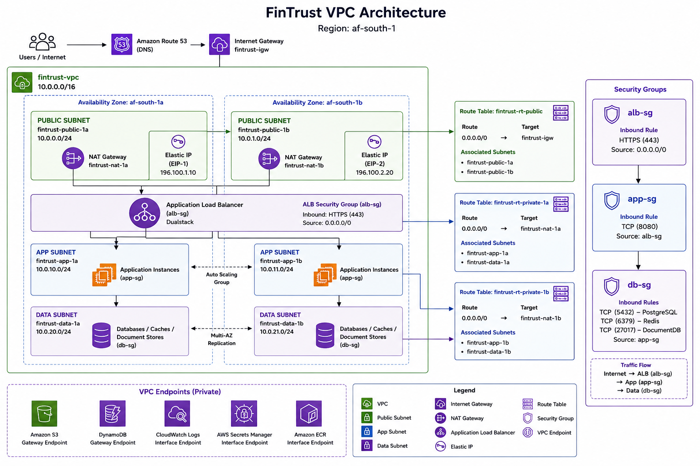

# Week 5 - Day 1: FinTrust VPC Build

**Focus:** Amazon VPC, Multi-AZ Networking, Route Tables, NAT Gateways, and Security Groups

**Lab:** LAB 180 – Build a Multi-AZ VPC

---

## Overview

This lab focused on designing and building the FinTrust Virtual Private Cloud (VPC) in AWS. The objective was to create a secure, highly available network architecture spanning two Availability Zones using public and private subnets, Internet and NAT Gateways, route tables, and Security Groups. This design provides secure internet access for public resources while keeping application and database resources isolated in private subnets.

---

## Architecture Diagram



---

# VPC Configuration

## VPC Details

| Resource | Name | CIDR / Configuration | Availability Zone |
|----------|------|----------------------|-------------------|
| VPC | fintrust-vpc | 10.0.0.0/16 | Regional |
| Public Subnet 1 | fintrust-public-1a | 10.0.0.0/24 | af-south-1a |
| Public Subnet 2 | fintrust-public-1b | 10.0.1.0/24 | af-south-1b |
| App Subnet 1 | fintrust-app-1a | 10.0.10.0/24 | af-south-1a |
| App Subnet 2 | fintrust-app-1b | 10.0.11.0/24 | af-south-1b |
| Data Subnet 1 | fintrust-data-1a | 10.0.20.0/24 | af-south-1a |
| Data Subnet 2 | fintrust-data-1b | 10.0.21.0/24 | af-south-1b |

---

# Internet Gateway

| Resource | Status |
|----------|--------|
| fintrust-igw | Attached to fintrust-vpc |

The Internet Gateway (IGW) enables resources in the public subnets to communicate with the internet by providing a route between the VPC and external networks.

---

# Route Tables

## Public Route Table

**Name:** `fintrust-rt-public`

| Destination | Target |
|------------|--------|
| 0.0.0.0/0 | fintrust-igw |

### Associated Subnets

- fintrust-public-1a
- fintrust-public-1b

---

## Private Route Table (AZ 1a)

**Name:** `fintrust-rt-private-1a`

| Destination | Target |
|------------|--------|
| 0.0.0.0/0 | fintrust-nat-1a |

### Associated Subnets

- fintrust-app-1a
- fintrust-data-1a

---

## Private Route Table (AZ 1b)

**Name:** `fintrust-rt-private-1b`

| Destination | Target |
|------------|--------|
| 0.0.0.0/0 | fintrust-nat-1b |

### Associated Subnets

- fintrust-app-1b
- fintrust-data-1b

---

# NAT Gateways

| NAT Gateway | Public Subnet | Status |
|-------------|---------------|--------|
| fintrust-nat-1a | fintrust-public-1a | Available |
| fintrust-nat-1b | fintrust-public-1b | Available |

Each Availability Zone has its own NAT Gateway, allowing resources in private subnets to initiate outbound internet connections while remaining inaccessible from the public internet. Deploying one NAT Gateway per Availability Zone improves both resiliency and availability.

---

# Security Groups

## alb-sg

### Inbound Rules

| Protocol | Port | Source |
|----------|------|--------|
| HTTPS | 443 | 0.0.0.0/0 |

**Purpose**

Allows secure HTTPS traffic from internet users to reach the Application Load Balancer.

---

## app-sg

### Inbound Rules

| Protocol | Port | Source |
|----------|------|--------|
| TCP | 8080 | alb-sg |

**Purpose**

Allows traffic only from the Application Load Balancer to the application servers.

---

## db-sg

### Inbound Rules

| Protocol | Port | Source |
|----------|------|--------|
| PostgreSQL | 5432 | app-sg |
| Redis | 6379 | app-sg |
| MongoDB | 27017 | app-sg |

**Purpose**

Restricts database access to application servers only.

---

# Security Group Chain

```text
Internet User
      │
      ▼
Application Load Balancer (alb-sg)
      │
      ▼
Application Layer (app-sg)
      │
      ▼
Database Layer (db-sg)
```

This layered security model prevents direct access to application servers and databases from the internet. Each layer communicates only with the layer immediately above or below it, following the principle of least privilege.

---

# Security Groups vs Network ACLs

| Security Groups | Network ACLs |
|----------------|--------------|
| Resource level | Subnet level |
| Stateful | Stateless |
| Return traffic automatically allowed | Inbound and outbound rules required |
| Protect EC2, ECS, RDS and other resources | Protect entire subnets |

## When should Security Groups be used?

Security Groups secure individual AWS resources. In the FinTrust architecture, they ensure only the Application Load Balancer can communicate with the application layer, and only the application layer can communicate with the database layer.

## When should Network ACLs be used?

Network ACLs provide subnet-level traffic filtering and can block or allow traffic before it reaches resources, adding another layer of network security.

---

# Knowledge Check

## If the af-south-1a NAT Gateway fails, which resources lose internet access in your build? Why?

Resources in **fintrust-app-1a** and **fintrust-data-1a** lose outbound internet access because their private route table sends internet-bound traffic through **fintrust-nat-1a**. Resources in **af-south-1b** continue operating because they use **fintrust-nat-1b**.

---

## What is the state of your VPC if you deploy an EC2 instance with a public IP in fintrust-public-1a? Can the internet reach it?

Yes. Because the instance resides in a public subnet associated with the public route table and has a public IP address, it is reachable from the internet, provided its Security Group permits inbound traffic.

---

## Why does db-sg reference app-sg as its source rather than the CIDR of the application subnets?

Referencing **app-sg** is more secure and easier to manage. Application instances automatically receive database access when assigned to the Security Group, making the design compatible with Auto Scaling and avoiding dependency on IP address ranges.

---

# Reflection

## 1. Describe the traffic path for a user's HTTPS request from the internet to an ECS task.

```text
Internet User
      │
      ▼
Amazon Route 53
      │
      ▼
Internet Gateway (IGW)
      │
      ▼
Application Load Balancer (alb-sg)
      │
      ▼
Amazon ECS Task (app-sg)
      │
      ▼
Database Layer (db-sg)
```

A user's request first reaches Amazon Route 53, which resolves the FinTrust domain name to the Application Load Balancer. The ALB receives the HTTPS request and forwards it to an ECS task running inside the private application subnet. If application data is required, the ECS task securely communicates with the database layer through the database Security Group.

---

## 2. What is the difference between associating a subnet with the public versus private route table, and why does it matter for security?

A public route table includes a route to the Internet Gateway, allowing resources with public IP addresses to communicate directly with the internet. A private route table routes outbound traffic through a NAT Gateway while preventing unsolicited inbound internet connections. Keeping application servers and databases in private subnets significantly reduces their exposure to external threats.

---

## 3. One thing about VPC networking that surprised you today.

The most surprising concept was that resources in a private subnet can still initiate outbound internet connections through a NAT Gateway while remaining inaccessible from the public internet. This allows backend services to install updates, access AWS services, and download dependencies without exposing them to inbound traffic.

---

# Lab Completion Summary

| Task | Status |
|------|--------|
| fintrust-vpc created (10.0.0.0/16) | ✅ |
| Six subnets created across two Availability Zones | ✅ |
| Internet Gateway attached | ✅ |
| Public route table configured | ✅ |
| Two NAT Gateways deployed | ✅ |
| Private route tables configured | ✅ |
| Security Groups configured correctly | ✅ |
| Security Groups vs Network ACL challenge completed | ✅ |
| Architecture diagram created | ✅ |
| Reflection completed | ✅ |

---

# Summary

This lab provided a practical understanding of AWS VPC networking and high-availability design. I implemented a production-inspired Multi-AZ network architecture using public and private subnets, Internet and NAT Gateways, route tables, and layered Security Groups. These networking components form the foundation for securely deploying highly available AWS workloads throughout the remainder of the FinTrust cloud architecture.