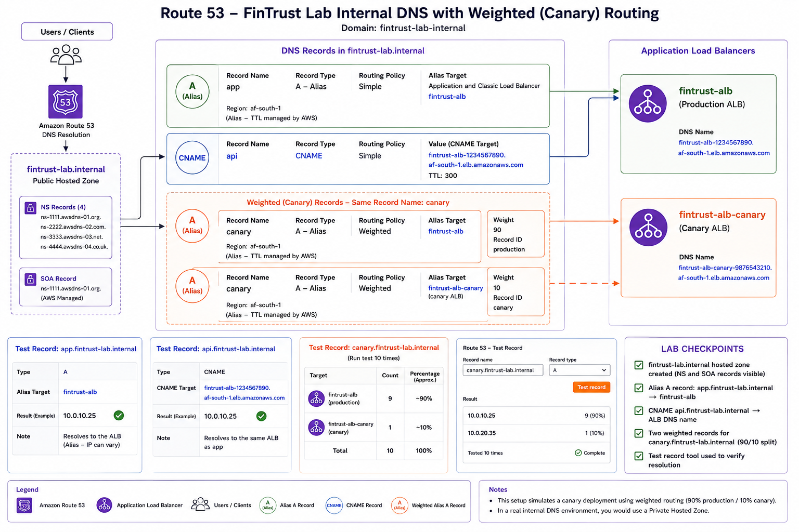

# Week 5 - Day 3: Amazon Route 53

**Focus:** Amazon Route 53, Hosted Zones, DNS Records, Routing Policies, and Traffic Management

**Labs:**
- LAB 174 – Amazon Route 53 Hosted Zone
- Route 53 Hosted Zone Lab & Routing Quiz

**Architecture Diagram:**

---

# Overview

This lab focused on configuring Amazon Route 53 for the FinTrust banking application. A public hosted zone was created, DNS records were configured using Alias and CNAME records, and weighted routing was implemented to simulate a canary deployment. I also explored the different Route 53 routing policies and how they improve application availability, performance, disaster recovery, and deployment strategies.

---

# Hosted Zone Configuration

| Setting | Value |
|----------|-------|
| Hosted Zone | fintrust-lab.internal |
| Type | Public Hosted Zone (Lab) |
| Region | Global (Route 53) |

AWS automatically created the following DNS records:

- NS (Name Server) Records
- SOA (Start of Authority) Record

---

# DNS Record Configuration

## Alias Record

| Setting | Value |
|----------|-------|
| Record Name | app.fintrust-lab.internal |
| Record Type | A (Alias) |
| Target | fintrust-alb |
| Routing Policy | Simple |

The Alias A record routes user traffic directly to the Application Load Balancer without requiring a public IP address.

---

## API Record

| Setting | Value |
|----------|-------|
| Record Name | api.fintrust-lab.internal |
| Record Type | CNAME |
| Target | fintrust-alb DNS Name |
| TTL | 300 seconds |

The CNAME record points the API subdomain to the same Application Load Balancer.

---

# Canary Deployment Using Weighted Routing

To simulate a canary deployment, two weighted DNS records were created with the same record name.

| Record ID | Target | Weight |
|-----------|--------|-------:|
| Production | fintrust-alb | 90 |
| Canary | canary-alb | 10 |

Approximately 90% of DNS requests are routed to the production environment, while 10% are directed to the canary deployment for validation before a wider rollout.

---

# Route 53 Routing Policies

| Routing Policy | Purpose |
|----------------|---------|
| Simple | Routes traffic to a single resource. |
| Weighted | Distributes traffic across multiple resources using assigned weights. |
| Failover | Redirects traffic to a healthy secondary resource when the primary becomes unavailable. |
| Latency | Routes users to the AWS Region with the lowest network latency. |
| Geolocation | Routes traffic based on the user's geographic location. |
| Geoproximity | Routes traffic based on geographic distance from AWS resources. |
| Multivalue Answer | Returns multiple healthy endpoints to improve availability. |

---

# Discussion Questions

## What is TTL propagation delay, and why does it matter for Failover routing?

TTL (Time To Live) defines how long DNS resolvers cache a DNS record before requesting an updated record from Route 53. During a failover event, users may continue using the cached record until the TTL expires, delaying the switch to the healthy endpoint. A shorter TTL enables faster failover but increases the number of DNS queries.

### What TTL would you set?

For the FinTrust banking application, I would configure a TTL of approximately **60 seconds** for failover records. This provides relatively fast recovery while keeping DNS query traffic at a manageable level.

---

## FinTrust wants to block users from specific countries due to regulatory restrictions. Which routing policy enables this? Can it block traffic entirely?

**Geolocation Routing** returns different DNS responses based on the user's country or continent. It can redirect users from restricted countries to an alternative endpoint or an informational webpage.

However, Route 53 **cannot completely block traffic** because it only controls DNS resolution. To fully deny requests, services such as **AWS WAF** should be used.

---

## How does Latency routing differ from Geolocation routing?

Latency Routing selects the AWS Region that provides the lowest network latency for the user, regardless of where they are physically located.

Geolocation Routing selects the destination based on the user's geographic location, such as their country or continent.

### Can a South African user be routed to the US East Region under Latency Routing?

Yes. If AWS determines that the US East Region currently offers lower network latency than the South Africa Region, Route 53 may direct the user there even though they are physically located in South Africa.

---

# Individual Reflection

## 1. Explain the weighted routing configuration you built. How would you change the weights for a gradual rollout?

The weighted routing configuration distributes DNS requests between two Application Load Balancers. Initially, almost all users continue accessing the stable production environment while a small percentage are directed to the new canary deployment for testing.

A gradual rollout could follow these stages:

| Deployment Stage | Production | Canary |
|------------------|----------:|-------:|
| Initial Release | 100% | 0% |
| Canary Testing | 90% | 10% |
| Expanded Rollout | 50% | 50% |
| Full Deployment | 0% | 100% |

This deployment strategy reduces risk by exposing new application versions to a small group of users before a complete rollout.

---

## 2. In what scenario would Geoproximity routing be better than Geolocation routing?

Geoproximity Routing is useful when traffic should be directed to the closest AWS Region based on physical distance instead of political boundaries such as countries or continents. It also supports bias values, allowing administrators to intentionally shift traffic between Regions for capacity planning or load balancing.

---

## 3. A client asks, "Can Route 53 replace my Load Balancer?" How do you answer?

No.

Amazon Route 53 is a DNS service that determines where users are directed by applying routing policies such as Simple, Weighted, Failover, and Latency routing.

An Application Load Balancer distributes incoming application traffic across multiple backend resources, performs health checks, supports path-based routing, and improves application availability.

Both services solve different problems and are commonly used together within the same architecture.

---

# Key Learning Points

- Route 53 is a globally distributed DNS service that routes users to AWS resources.
- Hosted Zones manage DNS records for internet-facing applications.
- Alias records integrate directly with AWS resources without requiring public IP addresses.
- Weighted routing supports gradual deployments such as canary releases.
- Failover routing improves application availability by redirecting traffic during outages.
- Latency routing optimises user experience by directing traffic to the Region with the lowest latency.
- Geolocation and Geoproximity routing solve different traffic management requirements.

---

# Lab Completion Summary

| Task | Status |
|------|--------|
| Hosted Zone created | ✅ |
| Alias A Record configured | ✅ |
| CNAME Record configured | ✅ |
| Weighted Routing implemented | ✅ |
| Canary deployment pattern demonstrated | ✅ |
| Routing policy comparison completed | ✅ |
| Reflection completed | ✅ |

---

# Summary

This lab provided practical experience configuring Amazon Route 53 for a production-inspired banking application. I learned how hosted zones, DNS records, and routing policies work together to deliver highly available, resilient, and scalable applications. The canary deployment exercise also demonstrated how DNS can be used to safely introduce new application versions while minimising deployment risk.