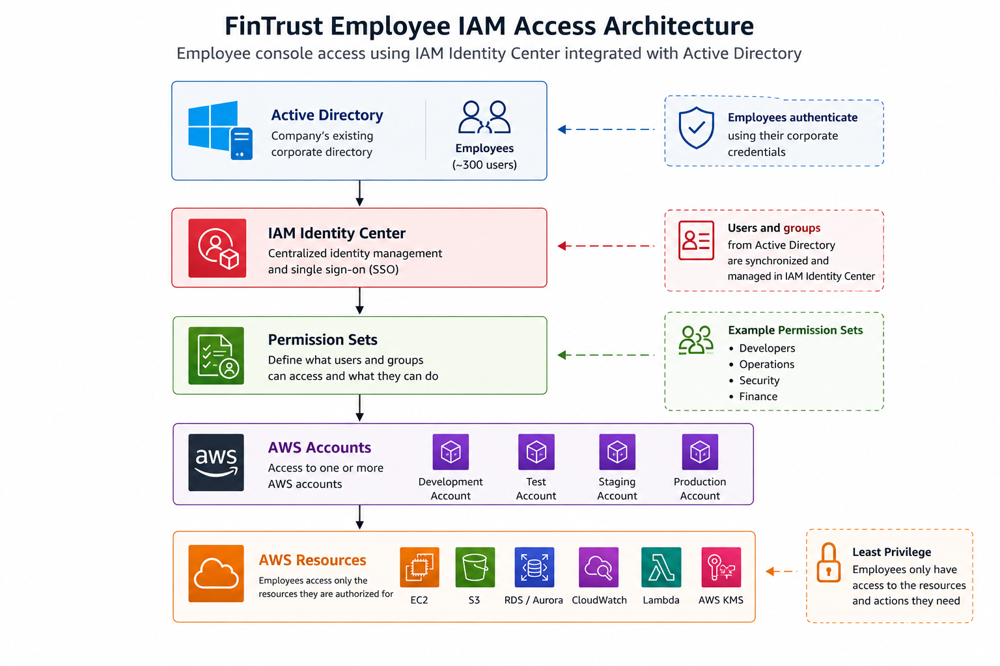
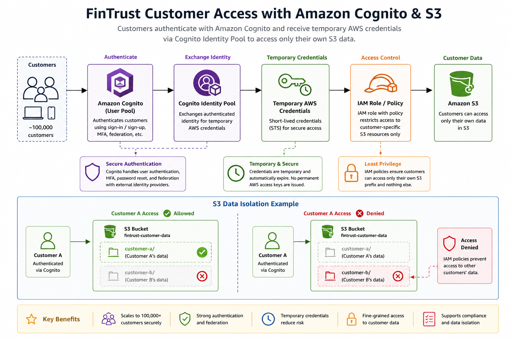
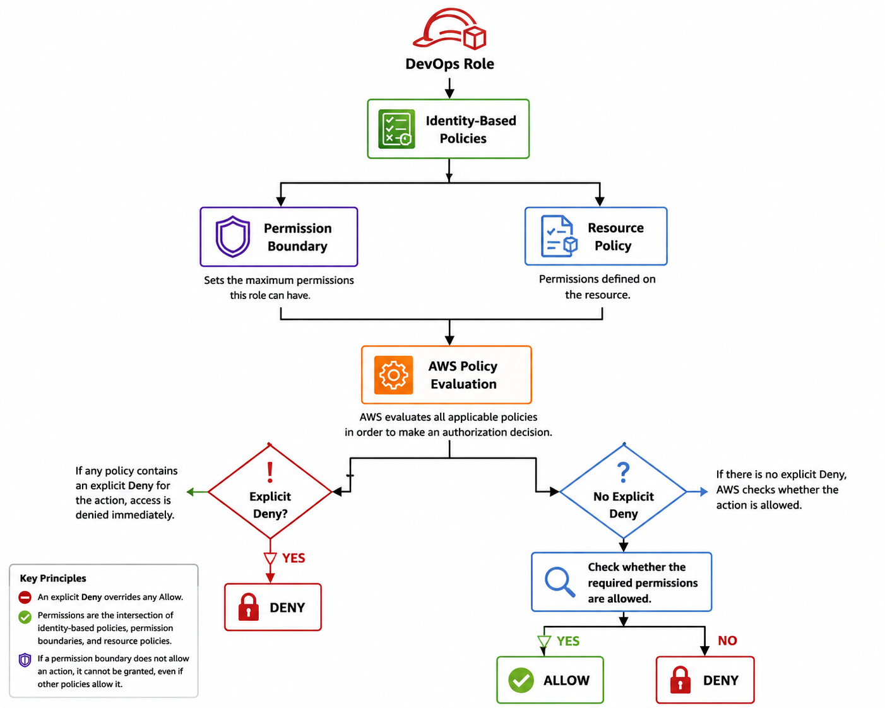

# Week 6 - Day 2: FinTrust IAM Design

## Overview

FinTrust needs to securely manage access for two very different groups:

* **300 employees** who require controlled access to AWS accounts and resources.
* **100,000 customers** who need secure access to their own data stored in Amazon S3.

The design separates **workforce identity** from **customer identity**.

**AWS IAM Identity Center**, integrated with the company's existing **Active Directory**, is used for employee access. **Amazon Cognito** with **Cognito Identity Pools** is used to provide customers with controlled access to their own S3 data.

A **Permission Boundary** is also applied to the DevOps role to limit the maximum permissions that the role can receive.

---

## 1. Employee Console Access - IAM Identity Center + Active Directory

FinTrust has approximately 300 employees who require access to AWS accounts and resources.

Instead of creating individual IAM users for every employee, FinTrust should use **AWS IAM Identity Center** integrated with the company's existing **Active Directory**.

Employees authenticate using their existing corporate credentials. IAM Identity Center maps Active Directory users and groups to permission sets. These permission sets determine which AWS accounts and resources each employee can access.

### Example Employee Groups

| Employee Group | Example Access               |
| -------------- | ---------------------------- |
| Developers     | Development resources        |
| Operations     | Production operations        |
| Security       | Security and audit services  |
| Finance        | Approved financial resources |

### Employee Access Architecture



The employee access flow starts with the company's existing Active Directory. Employees authenticate using their corporate credentials, after which IAM Identity Center provides centralized identity management and maps users and groups to appropriate permission sets.

The permission sets determine which AWS accounts and resources each employee can access.

This approach provides centralized identity management and makes employee onboarding and offboarding easier.

For example, when an employee leaves FinTrust, their access can be removed from the central identity system instead of having to manage individual IAM users across AWS.

It also avoids the operational overhead and security risks associated with maintaining hundreds of individual IAM users.

---

## 2. Customer Access - Amazon Cognito Identity Pools + S3

FinTrust has approximately **100,000 customers** who need secure access to their own data stored in Amazon S3.

Customer access should remain separate from employee AWS access.

FinTrust can use **Amazon Cognito** to authenticate customers and a **Cognito Identity Pool** to exchange authenticated customer identities for temporary AWS credentials.

These temporary credentials can be associated with an IAM role that allows the customer to access only the S3 resources they are authorized to access.

### Customer Access Architecture



The customer access flow starts with the customer authenticating through Amazon Cognito.

The authenticated identity is then provided to the Cognito Identity Pool, which can issue temporary AWS credentials. These credentials are used with an IAM role and policy to control access to the customer's S3 data.

Customers should not receive permanent AWS access keys.

Instead, Cognito Identity Pools can provide temporary credentials. IAM policies can then restrict access so that each customer can only access the S3 objects belonging to that customer.

### Example

Customer A could be restricted to:

```text
S3
└── fintrust-customer-data/
    └── customer-a/*
```

Customer A should not be able to access:

```text
S3
└── fintrust-customer-data/
    └── customer-b/*
```

This provides isolation between customers and follows the principle of least privilege.

---

## 3. DevOps Permission Boundary

FinTrust's DevOps team requires significant permissions to create and manage AWS resources.

However, giving the DevOps role unrestricted permissions would create unnecessary security risk.

A **Permission Boundary** can be applied to the DevOps IAM role.

The Permission Boundary defines the **maximum permissions** that the role can receive. It does not itself grant permissions. The role still requires identity-based policies to actually allow actions.

### Example

FinTrust could allow the DevOps role to manage approved services such as:

* EC2
* S3
* ECS
* CloudWatch
* VPC resources

while preventing the role from gaining permissions outside the approved security boundary.

### Why FinTrust Uses a Permission Boundary

The Permission Boundary provides an additional safeguard against excessive permissions.

Even if a broader IAM policy is attached to the DevOps role, the role cannot perform actions outside the permissions allowed by its Permission Boundary.

This helps FinTrust enforce least privilege while still giving the DevOps team enough access to perform their responsibilities.

---

## 4. IAM Policy Evaluation Chain

AWS evaluates multiple policy controls when determining whether an action should be allowed.

For the FinTrust DevOps role, the simplified evaluation flow is shown below.

### IAM Policy Evaluation Architecture



### Key Policy Evaluation Rule

> **An explicit Deny overrides an Allow.**

For the DevOps role, the effective permissions are limited by both the permissions granted through its identity-based policies and the maximum permissions defined by its Permission Boundary.

A simplified way to think about this is:

```text
Effective Permissions
=
Identity-Based Permissions
∩
Permission Boundary
```

If either side does not permit the action, the role cannot perform it.

The Permission Boundary therefore acts as a maximum permission limit rather than directly granting access.

---

## 5. Workforce vs Customer Identity

FinTrust should keep employee and customer access separate because they have different security and access requirements.

| Requirement     | Employees                        | Customers                      |
| --------------- | -------------------------------- | ------------------------------ |
| Identity system | Active Directory                 | Amazon Cognito                 |
| AWS service     | IAM Identity Center              | Cognito Identity Pools         |
| Users           | ~300 employees                   | ~100,000 customers             |
| Access type     | AWS console and resources        | Customer-specific S3 data      |
| Credentials     | Corporate identity               | Temporary AWS credentials      |
| Access control  | Permission Sets and IAM policies | IAM roles and policies         |
| Main goal       | Workforce access management      | Secure customer data isolation |

---

## 6. Why This Design Fits FinTrust

The IAM architecture separates **workforce access** from **customer access** instead of trying to manage both groups using the same IAM model.

### Employees

Employees use their existing corporate identities through Active Directory and IAM Identity Center.

This gives FinTrust:

* Centralized identity management
* Easier onboarding and offboarding
* Group-based access
* Permission Sets for different job functions
* Reduced need for individual IAM users

### Customers

Customers use Amazon Cognito and Cognito Identity Pools.

This gives FinTrust:

* Customer-specific authentication
* Temporary AWS credentials
* Controlled S3 access
* Separation between customer identities and employee identities
* Reduced exposure of long-term credentials

### DevOps

The DevOps role uses a Permission Boundary to restrict its maximum permissions.

This provides an additional control against excessive privileges and helps enforce least privilege.

---

## 7. Security Principles Applied

The design applies several important AWS security principles.

### Least Privilege

Users and roles should receive only the permissions required to perform their responsibilities.

### Separation of Duties

Developers, Operations, Security and Finance can receive different permissions based on their responsibilities.

### Centralized Identity Management

Employee identities are managed through Active Directory and IAM Identity Center instead of creating hundreds of individual IAM users.

### Temporary Credentials

Customers receive temporary AWS credentials through Cognito Identity Pools rather than permanent AWS access keys.

### Permission Boundaries

The DevOps role has a maximum permission boundary that limits the permissions it can receive.

### Customer Data Isolation

IAM policies can restrict customers to their own S3 data instead of allowing access to other customers' objects.

---

## Lab / Deliverable Completion

| Task                                                             | Status |
| ---------------------------------------------------------------- | ------ |
| IAM workforce access design completed                            | ✅      |
| IAM Identity Center and Active Directory architecture documented | ✅      |
| Cognito customer access architecture documented                  | ✅      |
| S3 customer data isolation documented                            | ✅      |
| DevOps Permission Boundary design documented                     | ✅      |
| IAM policy evaluation documented                                 | ✅      |
| Workforce vs customer identity comparison completed              | ✅      |
| Employee IAM architecture diagram completed                      | ✅      |
| Customer Cognito architecture diagram completed                  | ✅      |
| IAM policy evaluation diagram completed                          | ✅      |

---

## Conclusion

FinTrust should use different identity and access mechanisms for its employees and customers.

**IAM Identity Center with Active Directory** provides centralized workforce access for approximately 300 employees, while **Amazon Cognito with Cognito Identity Pools** provides controlled customer access for approximately 100,000 customers.

The **DevOps Permission Boundary** adds another layer of protection by limiting the maximum permissions available to the DevOps role.

Together, these controls support least privilege, centralized identity management, separation of duties, temporary credentials and customer data isolation.