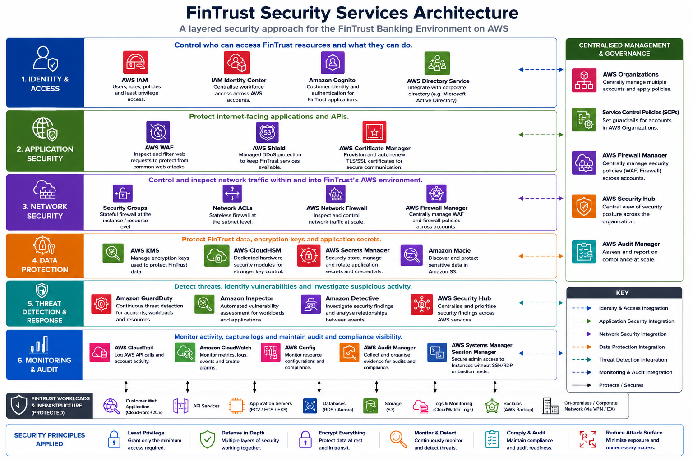

# Week 6 - Day 3: Security Services Summary

## Overview

This document summarises the AWS security services and concepts covered during Week 6 and explains which of them would be appropriate for the FinTrust banking environment.

The focus of the week was understanding AWS security across:

- Identity and access management
- Encryption and key management
- Data protection
- Network security
- Application security
- Threat detection and investigation
- Monitoring and auditing
- Compliance

The main hands-on activity completed during this part of the programme was **Lab 279: Introduction to IAM**. The other services were covered through theory, reading and security architecture discussions rather than being individually deployed as part of the FinTrust environment.

---

# 1. Security Services and Concepts Covered

This table summarises the services and concepts covered during the week.

| Service / Concept | What I Covered |
|---|---|
| **AWS IAM** | Users, roles, policies, permissions and least privilege. |
| **AWS IAM Identity Center** | Centralised workforce identity and access management across AWS accounts. |
| **Amazon Cognito** | Customer identity and authentication. |
| **AWS Directory Service** | Managed directory services and integration with existing directory environments. |
| **AWS Key Management Service (KMS)** | Encryption and management of cryptographic keys. |
| **AWS CloudHSM** | Dedicated hardware security modules for cryptographic operations. |
| **AWS Config** | Resource configuration monitoring and compliance evaluation. |
| **AWS Secrets Manager** | Secure storage and management of application secrets and credentials. |
| **AWS Certificate Manager (ACM)** | Managed TLS/SSL certificate provisioning and renewal. |
| **AWS WAF** | Web application firewall rules for inspecting and filtering web requests. |
| **AWS Shield** | Managed protection against Distributed Denial of Service (DDoS) attacks. |
| **AWS Network Firewall** | Network traffic inspection and filtering. |
| **AWS Firewall Manager** | Centralised management of firewall and security policies. |
| **Amazon Macie** | Sensitive-data discovery and monitoring in Amazon S3. |
| **Amazon GuardDuty** | Managed threat detection for AWS environments. |
| **Amazon Inspector** | Automated vulnerability assessment. |
| **Amazon Detective** | Security investigation and analysis. |
| **AWS Security Hub** | Centralised security findings and security posture management. |
| **AWS CloudTrail** | Logging of AWS API calls and account activity. |
| **Amazon CloudWatch** | Monitoring through metrics, logs, alarms and dashboards. |
| **AWS Systems Manager Session Manager** | Secure administrative access to managed instances without requiring direct SSH or RDP access. |
| **AWS Audit Manager** | Collection and organisation of audit evidence for compliance assessments. |
| **AWS Abuse / Trust & Safety** | Understanding AWS abuse reporting and escalation processes. |

---

# 2. Recommended FinTrust Security Services

Not every service covered during the week needs to be deployed in FinTrust.

The recommendation below is based on FinTrust's requirements as a banking environment, including strong identity management, customer data protection, encryption, application security, threat detection, monitoring, auditing and compliance.

| Service | Recommendation | How FinTrust Would Use It | Why FinTrust Would Use It |
|---|---|---|---|
| **AWS IAM** | ✅ Use | Manage roles, policies and permissions for AWS resources and workloads. | Enforces least privilege and limits unnecessary access. |
| **AWS IAM Identity Center** | ✅ Use | Manage employee access through centralised identities and permission sets. | Simplifies workforce access and makes onboarding and offboarding easier. |
| **Amazon Cognito** | ✅ Use | Authenticate FinTrust customers and provide controlled access to customer-facing applications. | Keeps customer identity management separate from workforce identity management. |
| **AWS Directory Service** | ✅ Use | Integrate AWS with FinTrust's existing corporate directory where required. | Allows existing organisational identities and directory-based access controls to be used with AWS. |
| **AWS KMS** | ✅ Use | Manage encryption keys used to protect sensitive FinTrust data. | Protects financial and customer information through controlled encryption. |
| **AWS Secrets Manager** | ✅ Use | Store database credentials, API keys and other application secrets. | Prevents sensitive credentials from being hard-coded or unnecessarily exposed. |
| **AWS Certificate Manager** | ✅ Use | Manage TLS certificates for HTTPS endpoints such as CloudFront and the Application Load Balancer. | Provides encrypted communication and simplifies certificate management. |
| **AWS WAF** | ✅ Use | Inspect and filter web requests reaching CloudFront or the ALB. | Helps protect FinTrust's public-facing applications and APIs from common web attacks. |
| **AWS Shield** | ✅ Use | Protect public-facing services such as CloudFront from DDoS attacks. | Helps maintain availability during DDoS attacks. |
| **AWS Config** | ✅ Use | Evaluate AWS resources against required security and compliance configurations. | Detects configuration drift and resources that no longer meet security requirements. |
| **AWS CloudTrail** | ✅ Use | Record AWS API activity and actions performed across the environment. | Provides accountability and an audit trail for security investigations and compliance. |
| **Amazon CloudWatch** | ✅ Use | Monitor infrastructure, applications, logs, metrics and alarms. | Helps FinTrust identify failures, performance issues and abnormal behaviour quickly. |
| **Amazon GuardDuty** | ✅ Use | Analyse AWS activity for suspicious or potentially malicious behaviour. | Provides continuous threat detection across the environment. |
| **AWS Security Hub** | ✅ Use | Centralise security findings from services such as GuardDuty, Inspector and Macie. | Gives the security team a consolidated view of security issues. |
| **Amazon Inspector** | ✅ Use | Assess supported workloads for software and configuration vulnerabilities. | Helps FinTrust identify weaknesses before they can be exploited. |
| **Amazon Detective** | ✅ Use | Investigate suspicious activity and relationships between security events and resources. | Helps security teams understand what happened during a potential incident. |
| **Amazon Macie** | ✅ Use | Discover and classify sensitive information stored in S3. | Helps protect customer and financial information and supports data protection requirements. |
| **AWS Systems Manager Session Manager** | ✅ Use where applicable | Provide secure administrative access to managed instances without exposing SSH or RDP to the internet. | Reduces the attack surface and removes the need for an internet-facing bastion host. |
| **AWS Audit Manager** | ✅ Use | Collect and organise evidence for security and compliance assessments. | Simplifies audit preparation and helps demonstrate compliance. |
| **AWS Network Firewall** | ⚠️ Consider | Inspect and filter network traffic where additional network-level controls are required. | Adds deeper network inspection beyond Security Groups and NACLs. |
| **AWS Firewall Manager** | ⚠️ Consider | Centrally manage WAF and firewall policies across multiple AWS accounts and resources. | Becomes useful as FinTrust grows into a larger multi-account environment. |
| **AWS CloudHSM** | ⚠️ Requirement-dependent | Provide dedicated hardware-backed cryptographic controls for specific high-security workloads. | Useful when FinTrust has requirements that justify dedicated HSM infrastructure. |
| **AWS Abuse / Trust & Safety** | Not an architecture component | Use AWS reporting and escalation processes when abuse or malicious activity needs to be reported. | Provides a formal process for escalating security and abuse concerns to AWS. |

---

# 3. FinTrust Security Architecture

The recommended services provide multiple layers of security rather than relying on a single security control.

The architecture is divided into several security layers:

### Identity & Access

Controls who can access FinTrust resources and what they are allowed to do.

Key services include:

- AWS IAM
- AWS IAM Identity Center
- Amazon Cognito
- AWS Directory Service

### Application Security

Protects internet-facing applications and APIs.

Key services include:

- AWS WAF
- AWS Shield
- AWS Certificate Manager

### Network Security

Controls and inspects network traffic.

Key controls include:

- Security Groups
- Network ACLs
- AWS Network Firewall where required

### Data Protection

Protects sensitive information, encryption keys and application credentials.

Key services include:

- AWS KMS
- AWS Secrets Manager
- Amazon Macie
- AWS CloudHSM where required

### Threat Detection & Response

Helps identify vulnerabilities, suspicious activity and potential security incidents.

Key services include:

- Amazon GuardDuty
- Amazon Inspector
- Amazon Detective
- AWS Security Hub

### Monitoring & Audit

Provides visibility into AWS activity, resource configurations, operational events and compliance.

Key services include:

- AWS CloudTrail
- Amazon CloudWatch
- AWS Config
- AWS Audit Manager

---

# 4. How the Recommended Services Work Together

The recommended services are designed to complement one another rather than operate independently.

## Identity and Access

**IAM**, **IAM Identity Center**, **Amazon Cognito** and **AWS Directory Service** control identities and permissions.

Employees can be managed through IAM Identity Center and corporate directory integration, while customers can use Cognito for application authentication.

IAM roles and policies enforce least privilege when users or workloads access AWS resources.

## Encryption and Data Protection

**AWS KMS** provides centralised encryption key management.

**AWS Secrets Manager** protects application credentials and secrets.

**Amazon Macie** can identify sensitive information stored in S3.

**AWS CloudHSM** can provide dedicated hardware-backed cryptographic controls where FinTrust has a specific requirement.

## Application Protection

**AWS WAF**, **AWS Shield** and **AWS Certificate Manager** protect internet-facing applications.

WAF filters potentially malicious web requests, Shield provides DDoS protection and ACM manages certificates used to secure HTTPS communication.

## Network Security

**Security Groups**, **Network ACLs** and potentially **AWS Network Firewall** provide different levels of network protection.

Security Groups control traffic at the resource level, NACLs provide subnet-level stateless filtering and Network Firewall can provide additional network traffic inspection.

## Threat Detection and Investigation

**Amazon GuardDuty** detects suspicious activity.

**Amazon Inspector** identifies vulnerabilities.

**Amazon Detective** helps investigate security findings and understand relationships between events and resources.

**AWS Security Hub** brings security findings together into a central security view.

## Monitoring and Audit

**AWS CloudTrail** records AWS API activity.

**Amazon CloudWatch** monitors metrics, logs and operational events.

**AWS Config** monitors resource configurations and compliance.

**AWS Audit Manager** can collect evidence to support audits and compliance assessments.

## Administrative Access

**AWS Systems Manager Session Manager** can provide controlled administrative access to managed instances without requiring an internet-facing bastion host.

## Centralised Security Management

**AWS Firewall Manager** can help FinTrust centrally manage WAF and firewall policies across multiple AWS accounts if the organisation grows into a multi-account architecture.

---

# 5. Security Principles Applied

The recommended FinTrust architecture supports several important security principles.

### Least Privilege

Users and roles should receive only the permissions required to perform their responsibilities.

### Defense in Depth

FinTrust should use multiple security layers rather than relying on a single security control.

### Centralised Identity Management

Employee identities can be managed through Active Directory and IAM Identity Center rather than creating large numbers of individual IAM users.

### Encryption

Sensitive FinTrust data should be protected using encryption, with AWS KMS providing centralised key management.

### Secure Secret Management

Application credentials should be stored in Secrets Manager rather than hard-coded into applications or source code.

### Customer Data Protection

Cognito, IAM policies, S3 controls and Macie can work together to protect customer identities and sensitive customer data.

### Threat Detection

GuardDuty, Inspector, Detective and Security Hub provide complementary capabilities for identifying, assessing and investigating security threats.

### Monitoring and Accountability

CloudTrail, CloudWatch and AWS Config provide visibility into AWS activity, resource configurations and operational events.

### Compliance

AWS Config and Audit Manager can help FinTrust monitor controls and collect evidence required for compliance assessments.

### Reduced Attack Surface

Session Manager can provide administrative access to private instances without requiring an internet-facing bastion host.

---

# 6. Hands-on vs Theoretical Coverage

The main hands-on activity completed during this part of the programme was:

**Lab 279: Introduction to IAM**

The remaining services in this document were covered through theory, reading, discussions and architecture examples.

Therefore, the FinTrust applications and recommendations described above represent **how these services could be used in the target FinTrust environment**. They should not be interpreted as claiming that each service was deployed and configured during the lab.

---

# 7. FinTrust Security Architecture Summary

The recommended FinTrust security architecture uses multiple AWS services together rather than relying on one security product.

The architecture follows a layered security model:

**Identity → Application → Network → Data → Threat Detection → Monitoring & Audit**

The recommended core services are:

- **AWS IAM**
- **AWS IAM Identity Center**
- **Amazon Cognito**
- **AWS Directory Service**
- **AWS KMS**
- **AWS Secrets Manager**
- **AWS Certificate Manager**
- **AWS WAF**
- **AWS Shield**
- **AWS Config**
- **AWS CloudTrail**
- **Amazon CloudWatch**
- **Amazon GuardDuty**
- **AWS Security Hub**
- **Amazon Inspector**
- **Amazon Detective**
- **Amazon Macie**
- **AWS Audit Manager**
- **AWS Systems Manager Session Manager**

Additional services such as **AWS Network Firewall**, **AWS Firewall Manager** and **AWS CloudHSM** can be introduced when FinTrust's architecture or compliance requirements justify them.

---

# Conclusion

FinTrust should not deploy every AWS security service simply because the service exists.

Instead, the security architecture should be based on the risks and requirements of the banking environment.

The services covered during Week 6 provide a broad understanding of AWS security capabilities. From these, FinTrust can select the services that provide the most value for identity management, encryption, customer data protection, application security, threat detection, monitoring and compliance.

The recommended architecture combines multiple AWS security services to provide **defense in depth**, while avoiding unnecessary services and complexity.

The result is a security architecture designed around FinTrust's requirements rather than simply deploying every security service that was studied.