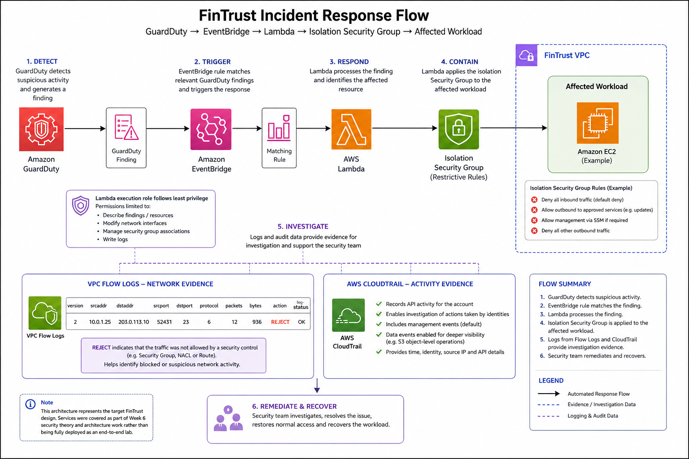

# Week 6 - Day 4: FinTrust Incident Response

## Overview

This document describes how FinTrust could automate its response to a security incident using AWS security and automation services.

The focus is on an incident-response chain where a security finding is detected, an event triggers an automated response, and the affected resource can be isolated using a dedicated Security Group.

The response flow uses:

- Amazon GuardDuty for threat detection
- Amazon EventBridge for event-driven automation
- AWS Lambda for the response logic
- Security Groups for workload isolation
- VPC Flow Logs for network-level investigation
- AWS CloudTrail for activity auditing

The incident-response architecture described here represents the target FinTrust design. These services were covered as part of the Week 6 security theory and architecture work rather than being fully deployed as an end-to-end automated incident-response lab.

---

## 1. Incident Scenario

FinTrust operates internet-facing applications and AWS workloads that process sensitive customer and financial information.

Consider a scenario where GuardDuty detects suspicious activity involving an EC2 workload.

For example, a workload could generate behaviour that GuardDuty identifies as potentially malicious.

FinTrust needs to be able to:

1. Detect the suspicious activity
2. Generate a security finding
3. Trigger an automated response
4. Isolate the affected workload
5. Preserve logs and evidence for investigation
6. Allow the security team to investigate and remediate the incident

Automating the initial containment step can reduce the time between detection and isolation.

---

## 2. Incident Response Architecture

The proposed FinTrust incident-response architecture is shown below.

The main automated response chain is:

**Amazon GuardDuty → Amazon EventBridge → AWS Lambda → Isolation Security Group → Affected Workload**

VPC Flow Logs and AWS CloudTrail provide supporting evidence that can be used during the investigation.

The architecture follows the general incident-response process:

**Detect → Trigger → Contain → Investigate → Remediate → Recover**

---

## 3. Detection - Amazon GuardDuty

Amazon GuardDuty provides managed threat detection for the AWS environment.

GuardDuty analyses supported AWS activity and generates findings when it identifies behaviour that may indicate a security threat.

For FinTrust, GuardDuty could be used to identify suspicious activity involving:

- AWS accounts
- EC2 workloads
- IAM credentials
- Network activity
- Other supported AWS resources

When a relevant finding is generated, it can become the starting point for an automated incident-response workflow.

### FinTrust Use

GuardDuty would act as the **detection layer**.

It identifies potentially malicious activity and produces a finding containing information about the event.

The security team could then investigate the finding, while high-confidence findings could trigger automated containment.

---

## 4. EventBridge - Triggering the Response

Amazon EventBridge can monitor AWS events and route matching events to targets.

For the FinTrust design, an EventBridge rule could match specific GuardDuty findings.

The rule would be designed to identify findings that meet predefined conditions, such as a particular severity or finding type.

Once a matching finding is detected, EventBridge can invoke the Lambda response function.

### Why EventBridge?

EventBridge allows the security response to be event-driven.

Instead of requiring a security administrator to manually monitor every finding, an appropriate finding can automatically start the response process.

This can reduce the delay between detection and containment.

---

## 5. Lambda - Automated Response

AWS Lambda can execute the response logic when EventBridge sends a matching event.

The Lambda function could:

1. Receive the GuardDuty finding
2. Identify the affected resource
3. Determine the appropriate containment action
4. Apply the isolation Security Group
5. Record the response
6. Return the result for further investigation

The exact implementation would depend on the affected resource and FinTrust's incident-response policy.

### Least-Privilege Execution

The Lambda execution role should follow the principle of least privilege.

It should receive only the permissions required to perform the approved containment actions.

For example, if the function only needs to modify Security Group associations, it should not receive unrestricted administrator permissions.

This limits the potential impact if the Lambda function or its execution role were compromised.

---

## 6. Security Group Isolation

The automated response can use a dedicated **isolation Security Group**.

The purpose of the isolation Security Group is to restrict the affected workload's network connectivity while the security team investigates the incident.

The isolation Security Group should be designed carefully so that required security-management access remains possible where appropriate.

For example, FinTrust may need to preserve controlled administrative access through **AWS Systems Manager Session Manager** while restricting normal application and network communication.

### Why Isolation?

Isolation reduces the potential impact of a compromised workload.

Instead of allowing a potentially compromised instance to continue communicating normally with other resources, FinTrust can restrict its network access while the incident is investigated.

This provides a rapid containment mechanism while preserving the workload for further investigation.

---

## 7. VPC Flow Logs - Network Investigation

VPC Flow Logs can provide visibility into network traffic involving resources in the FinTrust VPC.

A flow-log record can indicate whether traffic was accepted or rejected.

The `REJECT` action is particularly useful when investigating blocked or suspicious network communication.

### FinTrust Use

The security team could use Flow Logs to investigate:

- Source and destination addresses
- Source and destination ports
- Protocol
- Traffic timing
- Accepted traffic
- Rejected traffic

This can help determine what the affected workload was communicating with before and during an incident.

### Evidence

A VPC Flow Log sample should be included with the deliverable if an actual or approved simulated record is available.

The `REJECT` action should be clearly annotated and explained.

The evidence should not be presented as an actual FinTrust production log unless it was genuinely captured from the environment.

---

## 8. CloudTrail - AWS Activity Investigation

AWS CloudTrail records AWS API activity and provides an audit trail of actions performed in the AWS environment.

During an incident investigation, CloudTrail can help answer questions such as:

- Which identity performed an action?
- What AWS API operation was performed?
- When did the action occur?
- Which resource was affected?
- From where was the request made?

### Data Events

CloudTrail supports both management events and data events.

Data events provide additional visibility into data-plane operations for supported AWS resources.

For example, depending on the resource and configuration, data events can provide visibility into operations involving objects or data.

FinTrust can enable the appropriate data events when deeper auditing is required.

### Evidence

Confirmation of CloudTrail data-event configuration should be included if this was actually enabled.

If it was not enabled during the activities completed, the README should not claim that it was deployed.

---

## 9. Investigation and Evidence

Once the affected workload has been isolated, FinTrust's security team can investigate the incident using available evidence.

### VPC Flow Logs

VPC Flow Logs provide network-level evidence.

They can help identify:

- Where traffic originated
- Where traffic was going
- Which ports were involved
- Whether traffic was accepted or rejected
- When the communication occurred

### CloudTrail

CloudTrail provides AWS activity and API-level evidence.

It can help determine:

- Which identity performed an action
- Which API call was made
- When the action occurred
- Which AWS resource was affected

Using both sources gives the security team different views of the incident.

Flow Logs provide **network evidence**, while CloudTrail provides **AWS activity evidence**.

---

## 10. Incident Response Process

The FinTrust response process can be understood as six stages.

### 1. Detect

GuardDuty identifies suspicious activity and generates a finding.

### 2. Trigger

EventBridge evaluates the finding against a predefined rule.

### 3. Respond

If the finding matches the response criteria, EventBridge invokes Lambda.

### 4. Contain

Lambda applies the appropriate isolation Security Group to the affected workload.

### 5. Investigate

The security team uses VPC Flow Logs, CloudTrail and other security findings to understand the incident.

### 6. Remediate and Recover

The security team resolves the underlying issue, removes the threat and restores normal access once the workload has been determined to be safe.

---

## 11. Why Automation Matters for FinTrust

A manual response can introduce delays between detecting a threat and containing the affected resource.

For a banking environment, reducing this response time can be important because a compromised workload could potentially continue communicating with other resources while the security team investigates.

The EventBridge and Lambda response provides a way to perform an approved containment action immediately after a qualifying finding.

However, automation should be used carefully.

Not every security finding should automatically result in isolation.

FinTrust should define which findings are suitable for automated containment and which require human approval.

High-confidence findings could trigger automatic containment, while uncertain or potentially disruptive findings may require security-team review.

---

## 12. Security Principles Applied

### Automated Detection

GuardDuty provides continuous threat detection and can identify suspicious activity without requiring manual monitoring of every event.

### Event-Driven Response

EventBridge allows qualifying security findings to trigger an automated response.

### Least Privilege

The Lambda execution role should have only the permissions required to perform the approved containment actions.

### Defense in Depth

GuardDuty, Security Groups, VPC Flow Logs and CloudTrail provide different layers of security visibility and control.

### Rapid Containment

Applying an isolation Security Group can restrict an affected workload while the security team investigates.

### Auditability

CloudTrail and VPC Flow Logs provide evidence that can support security investigations.

### Human Oversight

Automated containment should be limited to clearly defined scenarios. Higher-risk or ambiguous findings may require manual investigation before isolation.

---

## 13. Hands-on vs Theoretical Coverage

The incident-response architecture in this document represents the proposed FinTrust design based on the security concepts covered during Week 6.

The end-to-end chain:

**GuardDuty → EventBridge → Lambda → Isolation Security Group**

was not deployed as a complete hands-on incident-response lab.

Therefore, the following should only be described as configured if actual evidence exists:

- GuardDuty finding
- EventBridge rule
- Lambda response function
- Isolation Security Group response
- VPC Flow Logs
- CloudTrail data events

Where no actual configuration was performed, screenshots or records should be clearly labelled as **simulated**, **example**, or **theoretical** rather than presented as deployed FinTrust infrastructure.

---

## 14. Deliverable Evidence

The following evidence supports the incident-response design:

| Evidence | Purpose | Status |
|---|---|---|
| **Incident Response Flow Diagram** | Shows the GuardDuty → EventBridge → Lambda → isolation response chain. | Architecture diagram |
| **GuardDuty Finding** | Demonstrates what a security finding could look like. | Simulated/example unless actually generated |
| **VPC Flow Log Sample** | Demonstrates a rejected network connection using a `REJECT` record. | Example/simulated unless actually captured |
| **CloudTrail Data Events Confirmation** | Demonstrates that relevant CloudTrail data events are enabled. | Include only if actually configured |

---

## 15. FinTrust Incident Response Summary

The proposed FinTrust incident-response architecture combines detection, automation, containment, investigation and recovery.

**Amazon GuardDuty** detects suspicious activity.

**Amazon EventBridge** identifies relevant findings and triggers the response.

**AWS Lambda** performs the approved automated response.

An **isolation Security Group** restricts the affected workload while the incident is investigated.

**VPC Flow Logs** provide network evidence, while **AWS CloudTrail** provides AWS activity and audit evidence.

The security team can then investigate, remediate the underlying issue and restore the workload once it has been determined to be safe.

The overall process is:

**Detect → Trigger → Contain → Investigate → Remediate → Recover**

This provides FinTrust with a structured incident-response approach while maintaining appropriate human oversight over automated security actions.

---

## Conclusion

FinTrust can use AWS security services to move from simple threat detection toward an automated incident-response process.

GuardDuty can detect suspicious activity, EventBridge can identify relevant findings, Lambda can execute an approved response and a dedicated Security Group can isolate the affected workload.

VPC Flow Logs and CloudTrail then provide additional evidence for investigation.

The architecture follows the principle of **defense in depth** by combining automated detection, rapid containment, network visibility and AWS activity auditing.

The design also recognises that automation should not replace security judgement. High-confidence incidents can be suitable for automated containment, while uncertain or high-impact findings may require human review.

The result is an incident-response design that allows FinTrust to respond quickly to potential threats while maintaining control, accountability and an auditable investigation process.